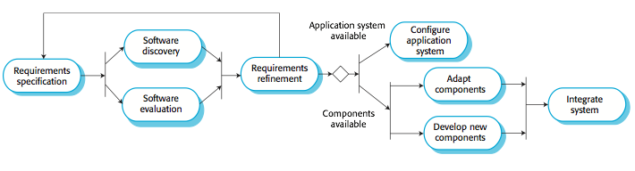

# Chapter 2 Software Processes

## Software process models

### Waterfall model

- Plan-driven model
- Separate and distinct phases of specification and development

#### Drawback of waterfall model

- Difficulty of accommodating change after the process is underway
- In principle, a phase has to be complete before moving on to the next phase

#### Waterfall model problem

- Inflexible partitioning of the project into distinct stages makes it difficult to respond to changing customer requirements.

---

### Incremental development

- Specification, development and validation are interleaved.
- Maybe plan-driven or agile.

#### Incremental development benefits

- The cost of accomodating changing customer requirements is reduced
- It is easier to get customer feedback on the development work that has been done.
- More rapid delivery and deployment of useful software to the customer is possible

#### Incremental development problems

- The process is not visible
  - No document / minimal document
- System structure tends to degrade as new increments are added
  - Unless time and money is spent on refactoring

---

### Integration and configuration / Reuse-oriented development

#### Advantages and disadvantages

- Reduced costs and risks as less software is developed from scratch
- Faster delivery and deployment of system
- But requirements compromises are inevitable so system may not meet real needs of users
- Loss of control over evolution of reused system elements

## Process activities

- Software specification
- Software development
- Software validation
- Software evolution

---

### Software specification

- The process of establishing what services are required and the constraints on the system's operation and development

- Requirement engineering process
  - Requirements elicitation and analysis
  - Requirements specificatino
  - Requirements validation

---

### Software design and implementation

- The process of converting the system specification into an executable system
- Software design
  - Design a software structure that realises the specification
- Implementation
  - Translate this structure into an executable program

#### Design activities

- Architectural design
- Database design
- Interface design
- Component selection and design

---

### Software validation

- Verification and validation is intended to show that a system conforms to its specification and meets the requirements of the system customer.

#### Stages of testing

---

### Software evolution

- Software is inherently flexible and can change.
- As requirements change through changing business circumstances, the software that supports the business must also evolve and change.